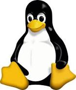

# Computación en Física

## Temas

Los temas que veremos a lo largo del curso serán los siguientes:

### Linux

- Introducción - Origen
- Directorios y Archivos
- Terminal
- Comandos
- Manipulación de directorios
- Manipulación de ficheros
- Uso de variables
- Combinación de herramientas
- Bash Scripting

### Git

- ¿Por qué hablar de VCS?
- ¿Qué es Git?
- ¿Es lo mismo Git que GitHub, Gitlab o Bitbucket?
- Introducción a Git
- Manejo de los cambios
- Flujos de trabajo
- Trabajo colaborativo con Git

### Python

- Entorno de desarrollo
- Elementos básicos del Lenguaje
- Funciones
- Manejo de Archivos
- Excepciones
- Módulos
- Programación orientada a objetos

Si desea ver la presentación en PDF: [CF_Clase_1.pdf](CF_Clase_1.pdf)