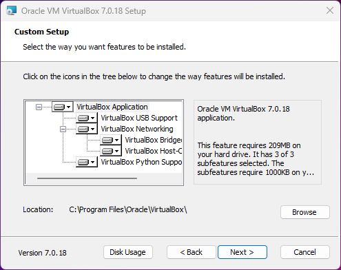
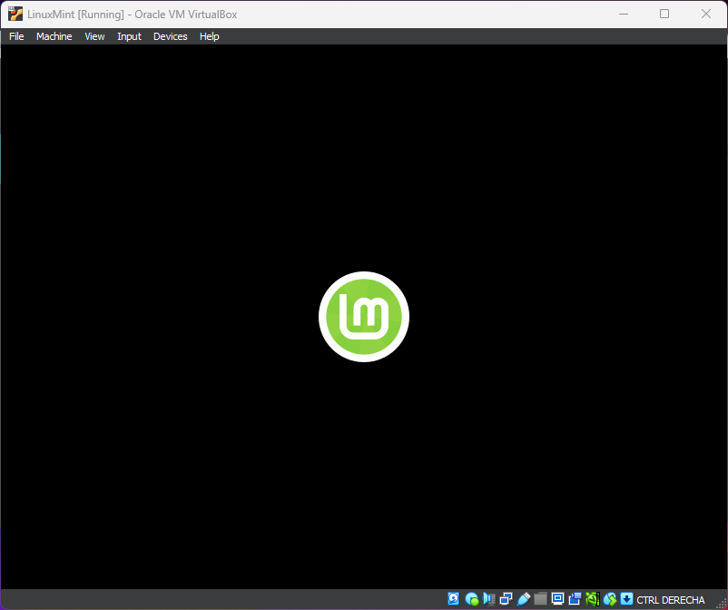

# Computación en Física

## Linux
### Origen
- **1969**: AT&T Bell Laboratories libera la primera versión del sistema operativo Unix.
- **1970**: La Universidad de California comienza a desarrollar el Berkeley Software Distribution - BSD a partir del código fuente de Unix
- **1978**: AT&T retira el permiso a la Universidad de California, generando la necesidad de promover la creación de un nuevo sistema operativo a partir de los aportes que ya habían realizado.
- **1983**: Richard Stallman crea el GNU Project el cual es un proyecto que impulsa la colaboración en masa del software libre y libera GNU como sistema operativo.
- **1991**: Linus Torvalds, desarrolla Linux, un proyecto el cual consistía en crear un núcleo (Kernel) de un sistema operativo libre.
- **1992**: Se libera la primera versión del sistema operativo Linux como un completo conjunto de software libre.
- **1992**: Se incluye el sistema X Window a Linux, permitiendo tener una interfaz gráfica de usuario.
- Siguientes años: Comenzaría la explosión de sistemas operativos:

### GNU

Creado por Richard Stallman. Su nombre es un acrónimo de GNU is Not Unix, haciendo énfasis a la libertad sobre el software. 

GNU es una colección de programas, juegos, aplicaciones, bibliotecas, herramientas de desarrollo y hasta juegos.

### Linux

Linux es el kernel que permite la comunicación entre el Hardware y el Software en un dispositivo. Sin embargo con el paso de los años las personas se refieren a Linux como el sistema operativo.

## VirtualBox
### Virtualización
- **¿Qué es la de virtualización**

    La virtualización es una tecnología que se puede usar para crear representaciones virtuales de servidores, almacenamiento, redes y otras máquinas físicas. El software virtual imita las funciones del hardware físico para ejecutar varias máquinas virtuales a la vez en una única máquina física

- **¿Qué tipos de virtualización existen?**
    - Virtualización de servidores
    - Virtualización de almacenamiento
    - Virtualización de red
    - Virtualización de datos
    - Virtualización de aplicaciones
    - Virtualización de escritorios

### VirtualBox
- **Virtual Box**
    VirtualBox es un potente producto de virtualización x86 y AMD64/Intel64 para uso empresarial y doméstico. VirtualBox no sólo es un producto extremadamente rico en funciones y de alto rendimiento para clientes empresariales, sino que también es la única solución profesional disponible gratuitamente como software de código abierto bajo los términos de la Licencia Pública General GNU (GPL) versión 3.

    [https://www.virtualbox.org/](https://www.virtualbox.org/)

- **Instalación**
    - Prerrequisitos:
    Descargar el software de [Visual C++ Redistributable](https://learn.microsoft.com/es-es/cpp/windows/latest-supported-vc-redist) que se requiere para Virtual Box. Posteriorment proceder con la instalación:

        

        

        

    - Virtual Box:
    A continuación se presentarán las imágenes del proceso de instalación:

        

        

        

        

        

        

        

        

### Linux Mint
- **Sistema Operativo**

    

    Linux Mint es una distribución de GNU/Linux comunitaria de origen franco-irlandesa basada en Ubuntu, y a su vez en Debian, que tiene por objetivo proveer ***'un sistema operativo moderno, elegante y cómodo que sea tanto poderoso como fácil de usar'***

- **Virtual Box**

    - Configuración:
    Las configuraciones requeridas en Virtual Box son:

        

        

        

        

    - Instalación:

        

        

        

        

Si desea ver la presentación en PDF: [CF_Clase_2.pdf](CF_Clase_2.pdf)