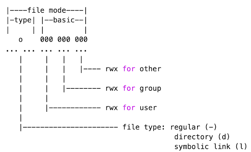

# Computación en Física

## Linux
### Interfaz gráfica
- Menú inicio
- Aplicaciones útiles ancladas
- Zona de notificaciones

### Directorios - Raíz
Directorio principal del sistema operativo. No tenemos un nivel superior que **/** (raíz)

Algunos de los directorios más importantes son:

- `/root`: Directorio principal del administrador del sistema
- `/boot`: Contiene archivos estáticos requeridos para arrancar el sistema operativo
- `/etc`: Directorio reservado para los archivos de configuración locales
- `/home`: Directorio de los diferentes usuarios del sistema operativo
- `/mnt`: Directorio creado para montar sistemas de archivos que se van a utilizar de forma temporal
- `/proc`: Directorio que contiene archivos especiales que envían o extraen información del kernel
- `/sys`: Directorio que contiene los archivos de configuración del sistema operativo que se está ejecutando
- `/bin` - `/sbin`: Directorio de archivos ejecutables del sistema operativo. El segundo es propiedad del usuario root
- `/lib`: Directorio de librerías compartidas

### Directorios - Home
Directorio de usuarios. Si tenemos más de un usuario, se tendrá carpeta para cada uno

### Directorios - Usuario
Carpetas que pertenecen al usuario. Similar a lo que tenemos en sistemas operativos como Windows.

### Terminal

La mayoría de sistemas operativos hoy en día cuentan con una interfaz gráfica que permite realizar acciones a través de click y doble clicks, que posteriormente el sistema operativo los interpreta y los convierte en comandos. Sin embargo antes de que los computadores tuvieran con este sistema gráfico, era necesario escribir los comandos a través de una terminal. Cada vez que se digitaba un comando, este ejecutaba otros programas, algunas veces imprimían en pantalla la salida, y al final muestra un aviso indicando que se encuentra listo para el siguiente comando.

La terminal será el punto de acceso para realizar las operaciones vía comandos que hacemos en la interfaz gráfica

La interfaz del terminal permite conocer el usuario actual con el que nos encontramos trabajando, el nombre de la máquina e incluso el directorio donde nos encontramos. También permite identificar si el usuario es limitado `$`, o estamos como super usuarios: `#`

### Comandos básicos
#### Creación de carpetas
El comando que vamos a utilizar para la creación de carpetas será `mkdir`

#### Eliminación de carpetas
El comando que vamos a utilizar para la eliminación de carpetas será `rmdir`

#### Listar archivos y/o carpetas
El comando que vamos a utilizar para listar archivos y/o carpetas será `ls`

Algunas de las opciones de `ls` más utilizadas son:
- `-a`: do not ignore entries starting with .
- `-l`: use a long listing format
- `-R`: list subdirectories recursively
- `-h`: with -l and -s, print sizes like 1K 234M 2G etc.
- `-i`: print the index number of each file
- `-d`: list directories themselves, not their contents

Entendiendo el long list format:

